# Google Analytics 4 & BigQuery Data Analysis

## Overview
This repository showcases five analytical tasks implemented using **Google BigQuery** and **Google Analytics 4 (GA4)** datasets.  
The focus is on deriving actionable insights from marketing and web analytics data, measuring campaign effectiveness, and exploring user behavior to improve business decision-making.

---

## Task 1 — Marketing Campaign Performance Analysis

**Business Objective:**  
Identify high-performing campaigns, evaluate marketing spend efficiency, and detect audience engagement trends across Google and Facebook.

---

### Subtask 1.1 — Aggregated Spend Metrics
**Goal:** Calculate mean, max, and min daily spend for Google & Facebook campaigns separately.

Script | Output
:---: | :---:
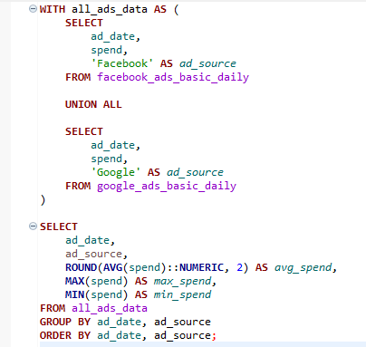 | 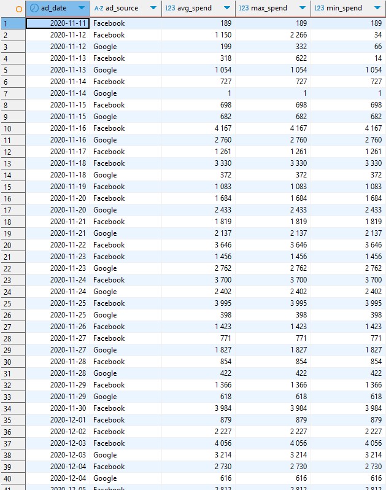

---

### Subtask 1.2 — Top-5 Days by ROMI
**Goal:** Identify the five days with the highest Return on Marketing Investment (ROMI) across all platforms.

Script | Output
:---: | :---:
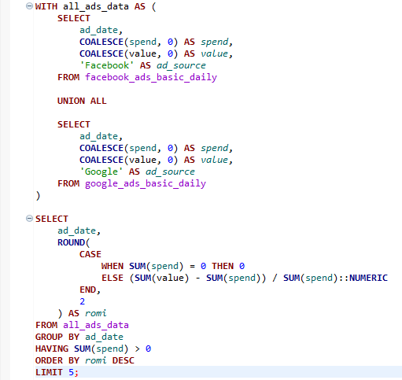 | 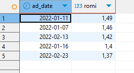

---

### Subtask 1.3 — Highest Weekly Total Value
**Goal:** Determine the campaign with the highest total value in a single week, including the week number.

Script | Output
:---: | :---:
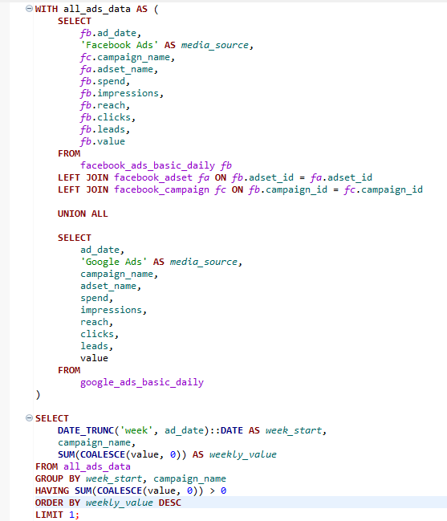 | 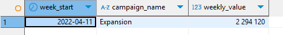

---

### Subtask 1.4 — Largest Month-to-Month Reach Growth
**Goal:** Find the campaign with the largest audience reach increase month-over-month.

Script | Output
:---: | :---:
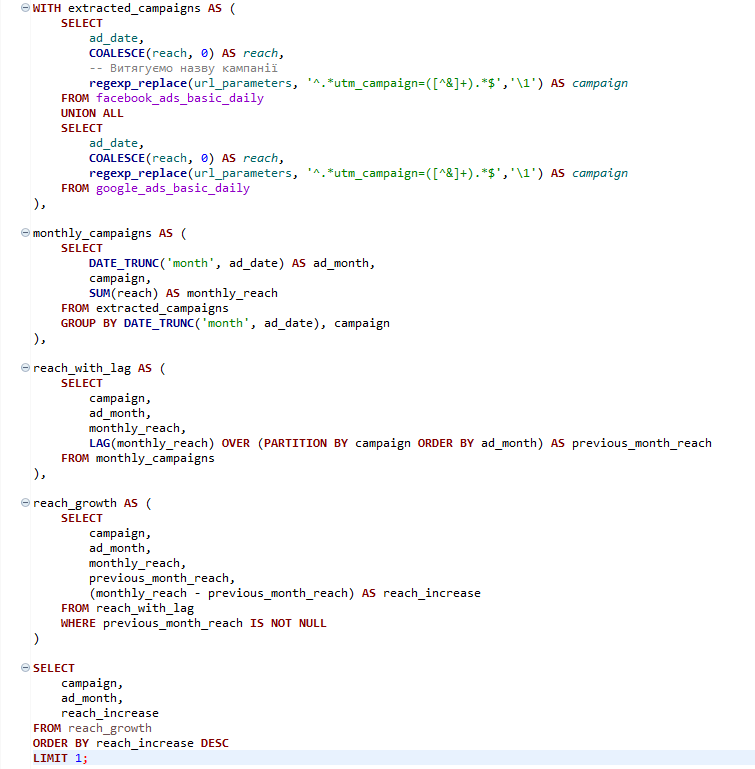 | 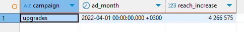

---

### Subtask 1.5 — Longest Continuous Ad Display *(Optional)*
**Goal:** Identify the adset_name with the longest uninterrupted daily display across Google and Facebook.

Script | Output
:---: | :---:
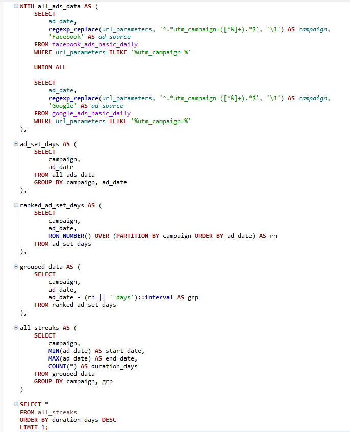 | 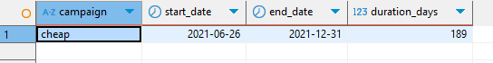

---

## Task 2 — Preparing GA4 Data for BI Reporting

**Business Objective:**  
Prepare a clean, well-structured GA4 dataset for integration into BI dashboards, enabling marketing, product, and management teams to track KPIs efficiently.

**Key Analysis Points:**
- Extract events, user identifiers, sessions, and campaign metadata from GA4.
- Filter for key events: session start, product view, add-to-cart, checkout initiation, shipping info addition, payment info addition, and purchase.
- Restrict data to events occurring in **2021** only.

**Visuals:**
Script | Output
:---: | :---:
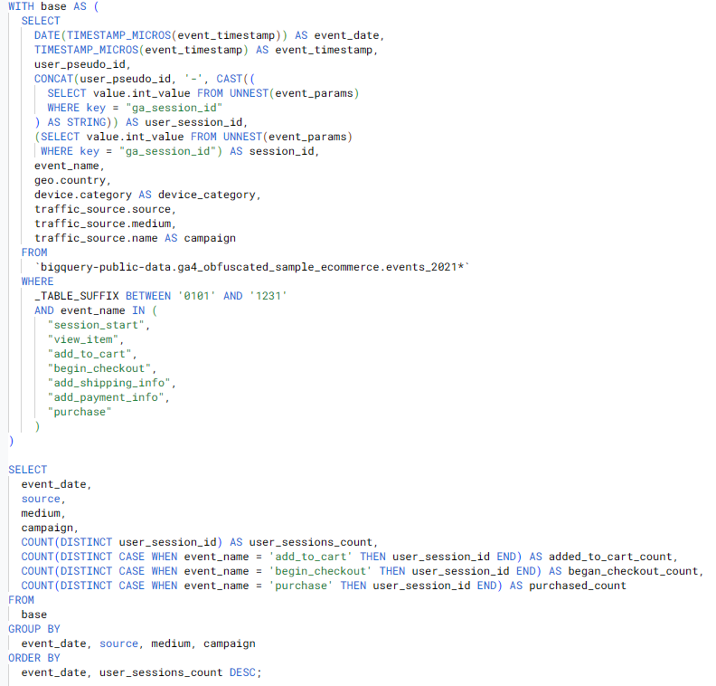 | 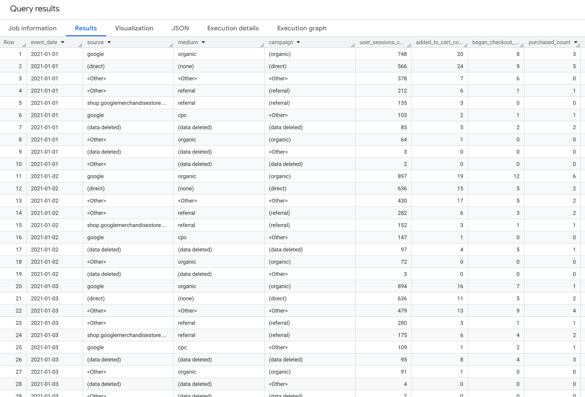

---

## Task 3 — Conversion Rate Analysis by Date & Traffic Channel

**Business Objective:**  
Calculate conversion rates from session start to various funnel stages by date and traffic source, enabling channel performance benchmarking.

**Key Analysis Points:**
- Conversion from visit → cart.
- Conversion from visit → checkout.
- Conversion from visit → purchase.
- Counting **unique sessions per unique user** to avoid duplication.

**Visuals:**
Script | Output
:---: | :---:
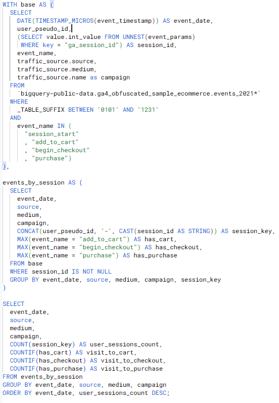 | 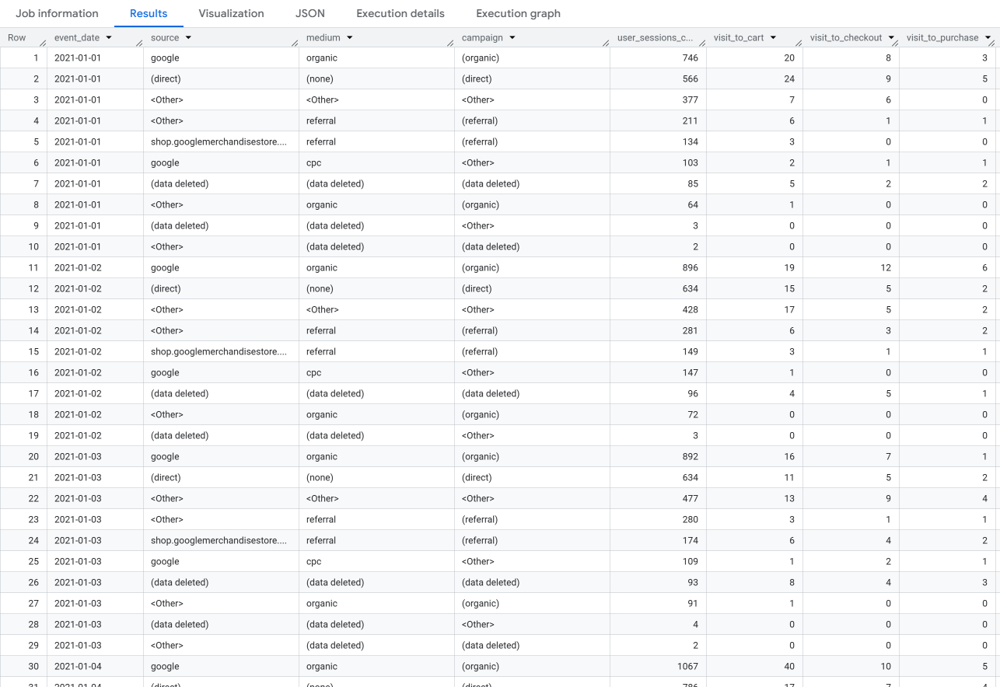

---

## Task 4 — Conversion Comparison Across Landing Pages

**Business Objective:**  
Evaluate the effectiveness of different landing pages in driving purchases.

**Key Analysis Points:**
- Extract `page_path` from session start events.
- Calculate:
  - Unique user sessions per page.
  - Purchases per page.
  - Conversion rate (visit → purchase).
- Merge session start events with purchase events by user & session ID.

**Visuals:**
Script | Output
:---: | :---:
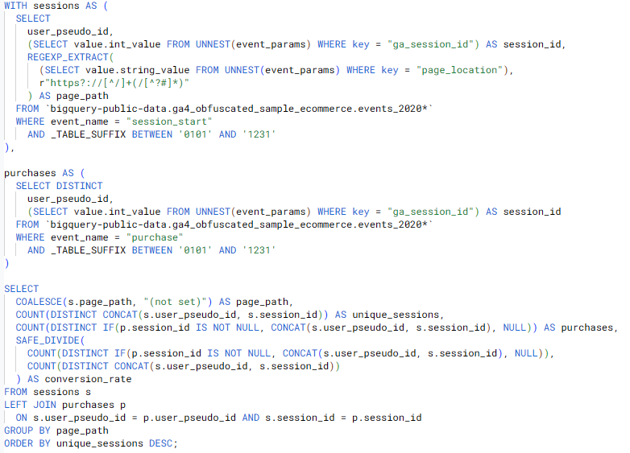 | 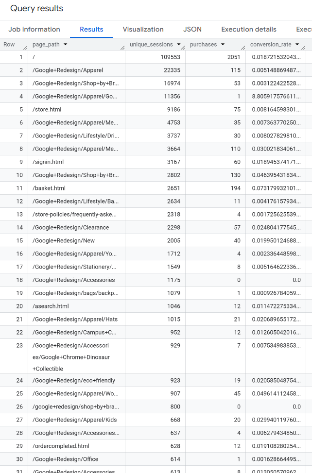

---

## Task 5 — Correlation Between Engagement and Purchases

**Business Objective:**  
Investigate whether user engagement metrics can be predictive of purchase behavior.

**Key Analysis Points:**
- Detect engaged sessions (`session_engaged = 1`).
- Calculate total engagement time (ms) per session.
- Identify sessions with purchases.
- Compute correlation coefficients between:
  - Engagement flag & purchase occurrence.
  - Engagement time & purchase occurrence.

**Visuals:**
Script | Output
:---: | :---:
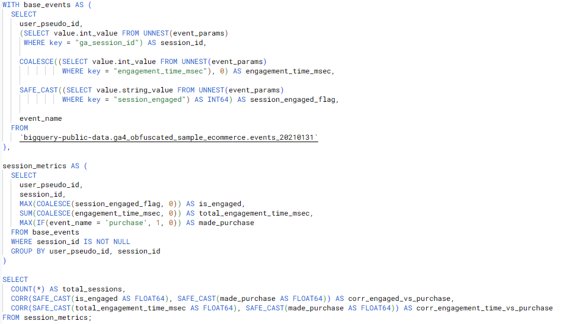 | 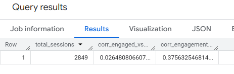

---

## Tools & Technologies
- **Google BigQuery** — Data querying and transformation.
- **Google Analytics 4** — Event-level website analytics data.
- **SQL** — Data manipulation and metric calculation.
- **Data Visualization** — Result outputs & BI dashboard-ready tables.

---

## Business Impact
- **Campaign Optimization:** Identified top-performing days and campaigns, supporting better budget allocation.
- **Funnel Analysis:** Measured drop-offs at each stage of the purchase funnel.
- **Landing Page Insights:** Highlighted which pages convert best, informing A/B testing strategies.
- **Engagement Analysis:** Evaluated the link between engagement and purchases, contributing to user retention strategies.
